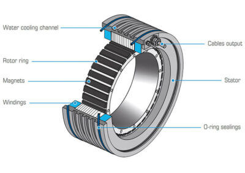

# SmartJoint: Direct-drive intelligent joint

**Autonomous module for robotics, prosthetics and exoskeletons. Integrates motor, absolute sensor, local controller and high-speed communication.**

SmartJoint is not a generic motor. It is a complete system that includes:

- Direct-drive motor (no gears, no backlash).
- Inductive position sensor AS5715R (360° absolute, <0.075°).
- Local STM32F405 controller with PID.
- Power driver (48V, 10A).
- Fiber optic communication (1 Mbps serial bus).
- Optional liquid cooling.

It does not depend on an external controller. Each joint is intelligent.

---

## What problem does it solve?

Current robotic joints are clumsy, expensive or difficult to integrate:

- Geared servomotors have backlash and wear out.
- Stepper motors lose steps under load.
- Linear actuators are slow and noisy.
- Industrial systems are closed and expensive (thousands of dollars per joint).

SmartJoint is open, modular and low-cost. An engineer with a 3D printer and electronics knowledge can build a 4-joint prosthetic arm for less than 500 USD.

---

## Technical specifications

| Parameter | Value |
|-----------|-------|
| Diameter | 60 mm |
| Length | 80 mm |
| Weight | 400-500 g |
| Maximum torque | 50 Nm (peak), 20 Nm (continuous) |
| Maximum speed | 300 rpm |
| Power supply | 48V DC |
| Idle consumption | 5 W |
| Motion consumption | 50-200 W (peak), 10-30 W (average in oscillatory use)* |
| Position accuracy | ±0.1 degrees |
| Sensor resolution | <0.075 degrees |
| Sensor range | 360° absolute |
| Communication | UART over fiber optic or RS-485 |
| Control frequency | 1 kHz |
| Cooling | Optional liquid (peaks up to 50W)* |

*Note: SmartJoint is optimized for bounded oscillatory motion (typically 40°-180°), not continuous rotation. The 50W and 200W values are short-duration peaks (<5 seconds). In normal use (walking, grasping), average power is 10-30W per joint. CORPUS's 80-120W continuous cooling system is sufficient. See `update.md` for technical details.*

## Conceptual diagram

*Cutaway conceptual view. Components: liquid cooling channel, rotor with magnets, stator with windings, cable outlet and O-ring seals.*

---
## Thermal regime and motion type

**SmartJoint is optimized for bounded oscillatory motion** (typically 40° to 180° of travel), similar to a biological joint (shoulder, elbow, knee). It is not a continuous rotation motor like those used in wheels or conveyor belts.

**Consequences for cooling:**

- The 50W per joint figure is a **short-duration peak** (less than 5 seconds), achievable only under maximum effort (e.g., lifting 50kg with one joint).
- In typical use (walking, grasping, gesturing), average power is **10 to 30W per joint**.
- Optional liquid cooling **only activates during very short peaks**. The rest of the time, dissipation is passive.
- For **continuous rotation** applications (e.g., robot wheels), continuous active liquid cooling or reducing maximum torque to 50% is recommended.

**In summary:** SmartJoint does not need a massive cooling system because its natural use is intermittent and oscillatory, not continuous.

---

## Position measurement system

SmartJoint uses an **AS5715R inductive sensor** that operates over a **machined conductive phonic wheel** attached to the rotor.

This principle is widely used in automotive applications (crankshaft sensors, ABS systems, electric power steering), offering:

- Robustness against dirt, external magnetic fields and vibrations.
- Resolution of <0.075° and accuracy of ±0.1° with proper alignment.
- Absolute operation (no homing required at power-up).

The phonic wheel is machined from aluminum or copper with standard automotive tolerances (eccentricity <0.1 mm, controlled concentricity). Final assembly can be calibrated in firmware to compensate for minor mechanical deviations.

---

## Control modes

- **Position mode:** Moves to the indicated angle (in degrees).
- **Speed mode:** Rotates at the indicated angular speed (degrees/second).
- **Torque mode:** Applies the indicated torque (Nm) to the shaft.
- **Safe mode (link failure):** Hardware configurable. Can be "hold" (maintains position with reduced torque) or "free" (deactivates the motor).

---

## Bill of materials

| Component | Model | Cost (USD) |
|-----------|-------|-------------|
| Machined stator and rotor | Custom design (external manufacturing) | 20-30 |
| N52 neodymium magnets | Various (e.g., SuperMagnetMan) | 10-15 |
| Copper windings | AWG 24 wire | 5-10 |
| Inductive sensor | AS5715R (ams AG) | 12-15 |
| Conductive phonic wheel | Machined aluminum or copper | 5-10 |
| Microcontroller | STM32F405 (or similar) | 10-15 |
| Motor driver | DRV8320 (Texas Instruments) | 8-12 |
| Voltage regulators | 48V -> 5V -> 3.3V | 5-10 |
| Controller PCB | Custom design (JLCPCB) | 10-15 |
| SFP transceiver (optional) | TP-Link TL-SM311LS | 25-30 |
| Connectors and cables | Various | 10-15 |
| **Total (approximate)** | | **120-180 USD** |

In volume (>100 units), cost can drop to 60-100 USD per joint.

---

## Project status

- [x] Concept defined.
- [x] Complete technical specifications.
- [x] Components selected.
- [ ] Mechanical design (STEP/STL drawings) (pending).
- [ ] Electronic schematic (KiCad) (pending).
- [ ] Controller PCB (pending).
- [ ] Firmware (C++ for STM32) (pending).
- [ ] Functional prototype (pending).
- [ ] Torque, speed and thermal dissipation tests (pending).

---

## Repository structure

- `docs/` - Technical documentation (specifications, guides).
- `hardware/` - Mechanical drawings (STEP/STL) and electronic schematics (KiCad).
- `firmware/` - Source code for STM32.
- `software/` - Control examples (Python, C++).
- `LICENSE` - Copyright (non-commercial use permitted, commercial requires license).

---

## How to contribute

This is an open project (in terms of documentation, not commercial license). You can:

- Open an issue to report errors in the specification.
- Propose improvements (alternative components, design changes).
- Share your own designs or firmware (under the same license).

Commercial contributions without express authorization from the author are not accepted.

---

## Author

**Enrique Aguayo H.** – Mackiber Labs  
Contact: eaguayo@migst.cl  
ORCID: 0009-0004-4615-6825  
GitHub: @enriqueherbertag-lgtm

*Documentation assisted by DeepSeek (AI) in writing and structure.*

---

## License

Copyright © 2026 Enrique Aguayo. All rights reserved.

**Permitted:** Non-commercial use for educational or research purposes. Unmodified distribution with attribution.

**Prohibited without express authorization:** Commercial use, modification for production environments, distribution of modified versions.

For commercial licenses: eaguayo@migst.cl
